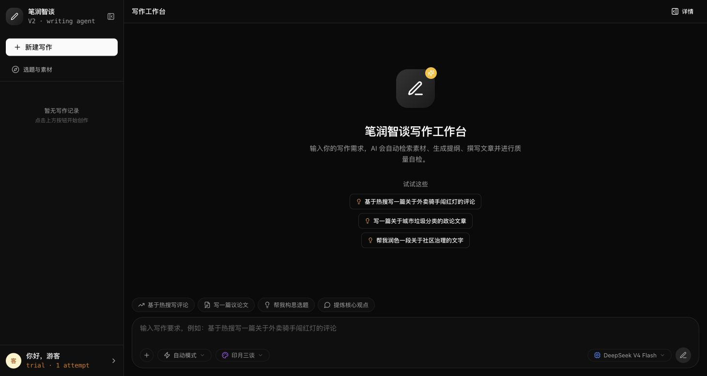

# LuminBuddy V2

[中文](README.md) · [Live workspace](https://luminbuddy2.ericdocmic.top/v2/) · [Changelog](#changelog)

An AI writing workspace for Chinese content creators. It turns a one-shot generation request into an observable and interruptible product flow: intent routing, Harness-LLM orchestration, source retrieval, outline confirmation, style-aware writing, post-review, feedback, A/B evaluation, and tiered memory.



> **Maturity: engineering beta.** The repository contains a working frontend and backend, a single-layer Harness agent engine, an orchestrated writing pipeline, guided outlines, style profiles, A/B evaluation, feedback surfaces, tiered memory, session event logs, traces, and metrics. It does not yet claim public evidence of adoption, retention, or business outcomes.

## Product problem

General chat models can draft quickly, but real writing work still fails when the system misunderstands constraints, hides retrieval and reasoning inside one generation, offers no control at high-cost decisions, and loses user feedback after the session.

LuminBuddy separates those problems into explicit product mechanisms:

```text
request → intent routing (rule-first, ms-level)
       → Harness LLM orchestration (autonomous tool calls, session state persisted)
       → retrieval plan → sources → relevance
       → outline gate → style-aware streaming draft
       → post-review → feedback, A/B evaluation, and memory
```

| Stage | Mechanism | What users get |
|---|---|---|
| Describe task | Rule-first intent routing with LLM fallback | Casual phrasing resolves to write, polish, compress, expand, or free chat |
| Add sources | Query plan, multi-source retrieval, relevance filtering, semantic dedup | Visible provenance, less irrelevant content in drafts |
| Decide structure | Auto mode or Guided Mode | Generate directly, or confirm/edit/regenerate outline first |
| Produce draft | Style Profile + streaming + pause/resume | Style decoupled from code, generation is interruptible |
| Judge quality | Post Review, safety checks, Auto Fix | Low-severity issues auto-fixed; high-risk issues held for human judgment |
| Improve over time | Section feedback, A/B evaluation sets, tiered memory | Preferences and failure signals become reusable evidence |

## Product decisions

- **Harness orchestrates, LLM executes.** A single-layer Harness manages intent routing, tool registration, session state, and circuit-breaking; the LLM autonomously decides which tools to call, when to write, and when to revise. No nested ReAct + inner agent loop.
- **Rules before models where possible.** Deterministic intent signals run first; low-confidence cases can fall back to an LLM.
- **Human control at the outline.** Guided Mode lets the user confirm, edit, or regenerate structure before the expensive drafting step.
- **Style as a versioned product object.** Style Profiles can be managed, evaluated, rolled out, and rolled back independently of the pipeline.
- **Governed memory.** Hard preferences, learned patterns, and feedback signals have quality gates and conflict states instead of becoming permanent by default.
- **Evaluation and observability as product infrastructure.** Built-in A/B testing framework, step traces, and Prometheus-format metrics make failures diagnosable.

## Current capability map

| Status | Capability |
|---|---|
| Implemented | React 19 workspace, Go Harness agent engine, WebSocket events, pause/resume/cancel, Guided Mode, Style Profiles, post-review, auto-fix, user feedback, A/B evaluation framework, tiered memory, session event log, traces, metrics, grayscale routing, Passkey/WebAuthn auth, guest mode |
| Requires configuration | PostgreSQL 17 + pgvector/paradedb, model APIs, embeddings, external search sources, authentication providers |
| Early-stage | Multi-source reliability, labeled evaluation quality, long-term memory value, production feedback loops |
| Missing public evidence | Active users, repeat usage, measured quality lift, cost benefit, content adoption, business outcomes |

## Architecture

```text
React 19 + Vite
       │ REST / WebSocket
Go Harness Agent Engine
       ├─ Intent Routing (rule-first) / Memory Gate
       ├─ Harness LLM orchestration (autonomous tools, persistent session)
       ├─ Query Plan / Search / Relevance / Outline / Write
       ├─ Post Review / Auto Fix / Memory Extract
       ├─ Style Profile / A/B Evaluation / Feedback
       └─ Traces / Metrics / Session Event Log / Grayscale Routing
       │
PostgreSQL 17 + pgvector + paradedb (BM25)
```

See the [architecture blueprint](docs/01-architecture.md) and [Harness design](docs/architecture-c-design.md) for implementation details.

## Run locally

### Docker Compose (recommended)

```bash
cp .env.docker.example .env.docker
# Edit .env.docker: fill in model API keys and database password
docker compose up -d
```

Frontend at `http://localhost:3000`, backend health at `http://localhost:8080/api/v2/health`.

### Separate frontend and backend

```bash
cd backend && cp .env.example .env && go run ./cmd/server/
cd frontend && npm ci && npm run dev
```

### Validation

```bash
cd backend && go test ./...
cd frontend && npm ci && npm run build
```

End-to-end and A/B test scripts are in `backend/e2e-*.mjs`, requiring a reachable backend, database, and external service configuration.

### Deployment packaging

```bash
# Source only
./scripts/pack-for-1panel.sh

# Source + Docker images (recommended for servers in China)
./scripts/pack-for-1panel.sh --images
```

## Design documents

| Document | Contents |
|---|---|
| [Architecture](docs/01-architecture.md) | Agent engine, data flow, system boundaries |
| [Harness design](docs/architecture-c-design.md) | Single-layer LLM orchestrator design and tool granularity |
| [Database schema](docs/02-database-schema.md) | PostgreSQL, pgvector, migrations |
| [API spec](docs/03-api-specification.md) | REST and WebSocket protocol |
| [Style Profile](docs/04-style-profile.md) | Style versioning, rollout, rollback |
| [Grayscale routing](docs/05-grayscale-routing.md) | Profile flags and UID hash routing |
| [Evaluation](docs/06-evaluation.md) | Evaluation sets and triggers |
| [Feedback](docs/07-feedback.md) | Section feedback and reputation weights |
| [Admin Dashboard](docs/08-admin-dashboard.md) | Config, evaluation, observability |
| [Memory system](docs/11-memory-system.md) | Hard preferences, behavioral patterns, feedback signals |
| [Editorial system](docs/12-editorial-system.md) | Editorial task management and workflow |

## Project disclaimer

- This is a runnable personal product and engineering project, not a validated commercial deployment.
- External model, retrieval, and data source availability depends on respective service configurations and terms.
- The repository contains no production secrets; create local configuration from the example env files.

## Changelog

### v0.3.0 (2026-08-16)

- **Harness architecture**: Replaced nested UnifiedAgent ReAct with single-layer LLM continuous session orchestration; autonomous tool calls, cross-turn session persistence
- **A/B testing framework**: Editorial experiment orchestrator + result store for automated control/experiment group evaluation
- **Passkey auth**: WebAuthn passwordless login and device management; bind/delete Passkey from personal center
- **Session Event Log**: Append-only event log with session replay and reconnection support
- **Prompt injection defense**: Lean injection for chat intent, Token reduced 10.5%
- **SQL fix**: PostgreSQL type cast bug in `session_events.go`
- **Packaging script**: Fixed macOS mktemp compatibility and deleted-file handling

### v0.2.0

- Guided Mode: outline confirmation, editing, up to five regenerations
- Style Profile grayscale routing: version management, UID hash routing
- Post Review + Auto Fix: post-draft review and automatic correction
- Tiered memory system: hard preferences, behavioral patterns, feedback signals
- Prometheus metrics and trace pipeline
- Guest mode with upgrade-to-register flow

### v0.1.0

- React 19 workspace + Go Agent Pipeline
- WebSocket streaming events (pause/resume/cancel)
- Multi-source retrieval and relevance filtering
- Docker Compose one-command deployment

## License

[MIT](LICENSE)
